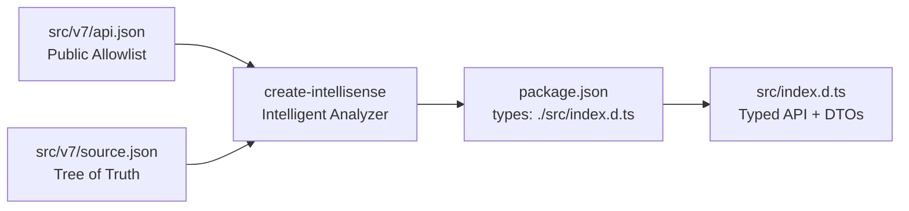

# create-intellisense

[](https://www.npmjs.com/package/create-intellisense)
[](LICENSE)
[](package.json)
[](package.json)

**Zero-dependency TypeScript declaration (`index.d.ts`) generator for JSON-driven NPM architectures.**

Automatically analyzes your versioned source tree (`src/v1`, `src/v2`, `src/v7`), parses your public route allowlist (`api.json`) and domain definition tree (`source.json`), infers strongly typed DTOs, and writes production-ready TypeScript declarations directly to your project's configured types path.

**[Documentation Hub](https://keshavsoft.github.io/create-intellisense/)** · **[View on npm](https://www.npmjs.com/package/create-intellisense)**

---

## 📖 The Story

In the **KeshavSoft JSON-Driven Architecture**, business routes and domain definitions live declaratively in JSON:
- **`source.json` (Tree of Truth)**: Contains the full domain specification, TDL/SQL definitions, action types, and data transformation schemas.
- **`api.json` (Allowlist / Inspection)**: Contains the exact array of string paths exposed on the public API (e.g., `["tally.masters.units.fetch"]`).

### The Challenge
Traditionally, library authors face two bad choices:
1. **Manual `.d.ts` Authoring**: Manually typing declaration files is tedious, prone to human error, and inevitably drifts out of sync as versions bump (`v5` → `v6` → `v7`).
2. **Copy-Pasting Generator Scripts**: Copying ad-hoc scripts (`scripts/dts/*` and `generate-dts.js`) across every repository pollutes codebases with boilerplate and duplicates logic.

### The Solution
`create-intellisense` extracts the entire analysis and type generation engine into a clean, zero-dependency CLI tool. Run it with one command, or add it as a `devDependency` to your package verification pipeline.



---

## ⚡ Quick Start

### 1. Instant One-Shot Generation (via npx)

Run directly inside any JSON-driven repository root:

```bash
npx create-intellisense
```

Or target a specific repository path:

```bash
npx create-intellisense ./packages/my-tally-client
```

Or specify a custom output file:

```bash
npx create-intellisense . -o ./types/index.d.ts
```

---

### 2. Recommended: Add as a `devDependency`

Install `create-intellisense` in your repository:

```bash
npm install --save-dev create-intellisense
```

Add the verification hook to your `package.json`:

```json
{
  "scripts": {
    "generate:dts": "create-intellisense",
    "test": "node --test test/test.js",
    "verify": "npm run generate:dts && npm test",
    "prepack": "npm run verify"
  },
  "devDependencies": {
    "create-intellisense": "^1.0.0"
  }
}
```

Now whenever you run `npm run verify` or publish your package, your TypeScript types are automatically synthesized from your active JSON specs with zero manual effort!

---

## 🧠 How It Works: The 4-Stage Pipeline

```text
 1. SCAN        Scans ./src/ for version directories (v1, v2, v7...) and finds active version
    │
 2. PARSE       Locates api.json (allowlist) and source.json (domain tree)
    │
 3. INFER       Synthesizes DTO interfaces from transformations & maps out callable API tree
    │
 4. WRITE       Resolves destination from package.json "types" field and writes index.d.ts
```

1. **Active Version Detection**: Inspects `./src/` to identify version folders (`v1`, `v2`, ... `v7`). It reads `src/index.js` to discover the active imported version, defaulting to the highest available.
2. **Dual-Layout Resolution**: Automatically supports both modern and legacy layout styles:
   - **Modern Flattened Layout**: `src/v7/api.json` and `src/v7/source.json` at the version root.
   - **Legacy Nested Layout**: `src/v6/external-api/api.json` and `src/v6/source.json`.
3. **DTO & Interface Synthesis**:
   - Inspects `source.json` transformation specs to generate named DTO interfaces (`UnitDto`, `StockItemDto`, etc.).
   - Builds nested namespace types (`TallyApi`, `AppApi`) reflecting the exact public method signatures.
4. **Smart Path Resolution**:
   - Checks `package.json` for the `"types"` or `"typings"` field (e.g. `"./src/index.d.ts"` or `"index.d.ts"`).
   - Writes directly to that file so NPM and IDEs immediately pick up the types.

---

## 🛠️ CLI Reference

```text
create-intellisense [target-directory] [options]
```

| Option | Alias | Description | Default |
| :--- | :--- | :--- | :--- |
| `[target-directory]` | — | Path to the root of the project to analyze | `.` (current directory) |
| `-o, --output <path>`| `-o` | Custom destination filepath for the generated `.d.ts` | Path from `package.json` `types` or `./index.d.ts` |
| `-h, --help` | `-h` | Display usage instructions and examples | — |
| `-v, --version` | `-v` | Display `create-intellisense` version | — |

---

## 📦 Programmatic API

You can also import and invoke `create-intellisense` inside your own JavaScript or Node.js build tools:

```javascript
import createIntellisense from "create-intellisense";

const result = createIntellisense({
    inProjectRoot: "./my-package",
    inOutFile: "./src/index.d.ts" // optional override
});

console.log(`Scanned: ${result.version}`);
console.log(`Routes:  ${result.routesCount}`);
console.log(`Written: ${result.outputFile}`);
```

---

## 📊 Comparison

| Feature | Manual `.d.ts` | In-Repo Generator Scripts | `create-intellisense` |
| :--- | :---: | :---: | :---: |
| **Zero Code Duplication** | ❌ (Written by hand) | ❌ (`scripts/dts/*` copied everywhere) | ✅ Single reusable CLI tool |
| **Always In Sync with JSON** | ❌ (Prone to drift) | ✅ | ✅ Guaranteed via JSON analysis |
| **Version Detection** | ❌ | Partial | ✅ Auto-detects active version |
| **Dual Layout Support** | ❌ | ❌ | ✅ Root & nested `api.json` |
| **Reads `package.json` types**| ❌ | ❌ (Hardcoded path) | ✅ Auto-routes to package.json |
| **Zero Dependencies** | ✅ | ✅ | ✅ 100% Native Node.js built-ins |

---

## 📚 Documentation Guides

- **[Visual Documentation Hub](docs/index.html)**: Interactive visual overview.
- **[Architecture Deep-Dive](docs/architecture.md)**: The 4-stage pipeline and internal engine breakdown.
- **[Usage & Integration Guide](docs/usage.md)**: Setup recipes for single repos, monorepos, and CI/CD pipelines.

---

## 📄 License

MIT © [KeshavSoft](https://github.com/keshavsoft)
