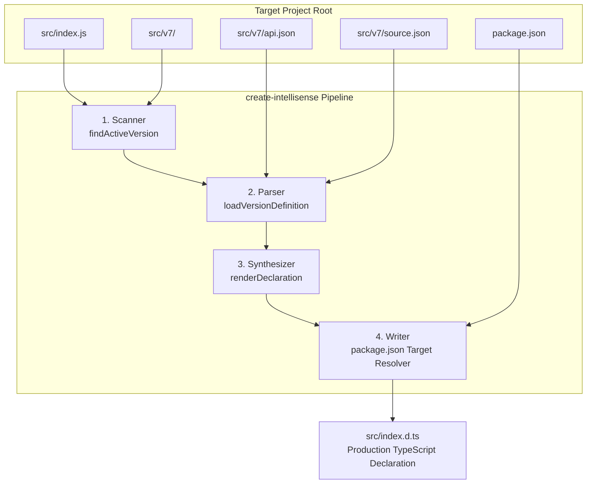

# Architecture: The 4-Stage Generation Pipeline

`create-intellisense` transforms JSON-driven service and domain specifications into robust TypeScript declarations without any external AST or compiler dependencies.

---

## High-Level Architecture Overview

---

## The 4 Pipeline Stages

### Stage 1: Scanner (`scan/findActiveVersion.js`)
The scanner determines which version of your code is currently live:
- Reads the `./src/` directory looking for directories matching the version pattern (`/^v(\d+)$/`).
- Reads `src/index.js` to inspect which version is actively imported (e.g. `import tally from "./v7/index.js"`).
- If no import match is found, it safely defaults to the highest available semantic version (`v7` > `v6` > `v1`).
- Returns the active version name, number, directory path, and `src` path.

### Stage 2: Parser (`parser/loadVersionDefinition.js`)
The parser discovers and normalizes the JSON specifications:
- **Allowlist Discovery**: Looks for `api.json` at the version root (`src/v7/api.json`). If absent, it checks the legacy location (`src/v6/external-api/api.json`).
- **Domain Tree Discovery**: Locates `source.json` at the version root or `internal-working/source.json`.
- Validates that `api.json` is a non-empty array of dot-notated endpoint paths.
- Builds an internal hierarchy tree, attaching metadata:
  - `__endpoint: true`
  - `__action`: target action name
  - `__resultKey`: response payload key
  - `__transformation`: schema mapping specification
  - `__description`: endpoint documentation comments

### Stage 3: Synthesizer (`renderer/renderDeclaration.js`)
The renderer constructs pure TypeScript declaration code:
- **DTO Synthesis**: Traverses the endpoint specs. If a `transformation` schema exists, it generates a typed interface (`UnitDto`, `StockItemDto`) mapping each altered key to its expected primitive or array type.
- **Callable Tree Synthesis**: Recursively generates nested object type definitions matching the dot-notation paths (e.g., `tally.masters.units.fetch(...)`).
- Attaches JSDoc comment blocks to every endpoint based on the action description.
- Assigns the global declaration name (`declare const tally: TallyApi; export default tally;`).

### Stage 4: Writer (`generator/index.js`)
The writer ensures output files land in the correct location without hardcoding:
- Checks if a custom output path was passed via CLI (`-o <file>`).
- If no path was passed, it reads `package.json` in the target project root.
- If `package.json` specifies `"types": "./src/index.d.ts"`, it writes directly to `src/index.d.ts`.
- If `package.json` specifies `"types": "index.d.ts"`, it writes to the root.
- Returns a summary object containing the scanned version, number of routes processed, and the written file path.

---

## Design Principles

1. **Zero Runtime Dependencies**: Relies exclusively on Node.js core modules (`node:fs`, `node:path`).
2. **Backward & Forward Compatibility**: Works seamlessly with modern flattened layouts and legacy nested folder conventions.
3. **In-Local Naming Convention**: Internal variables and parameters adhere to the `in*` and `local*` convention.
4. **Idempotence**: Running the generator multiple times produces identical, deterministic output.
